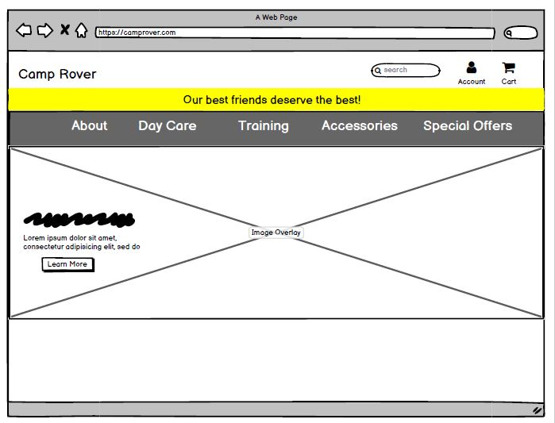
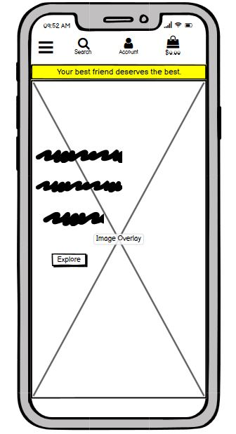
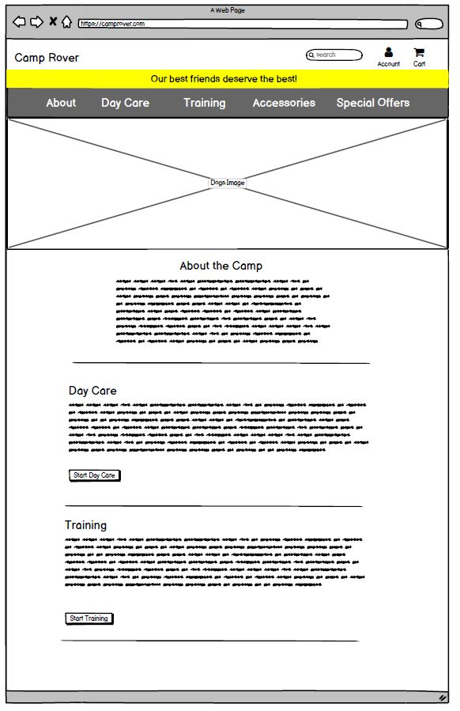
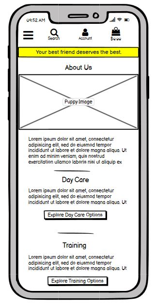
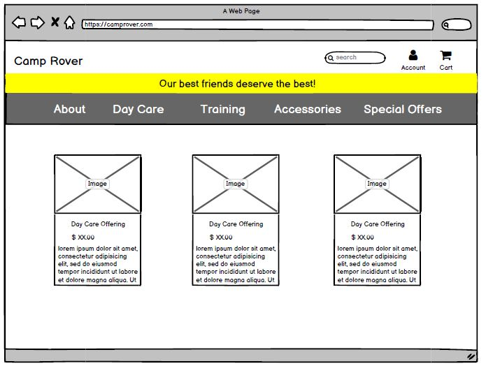
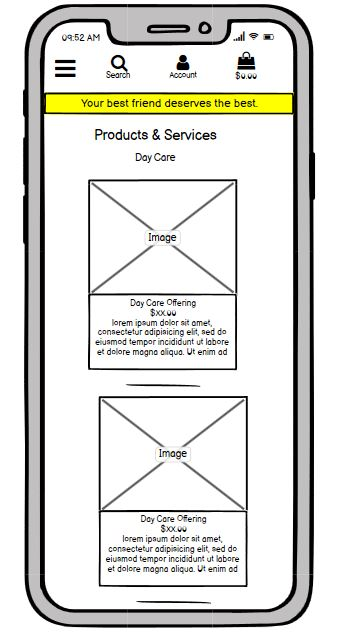
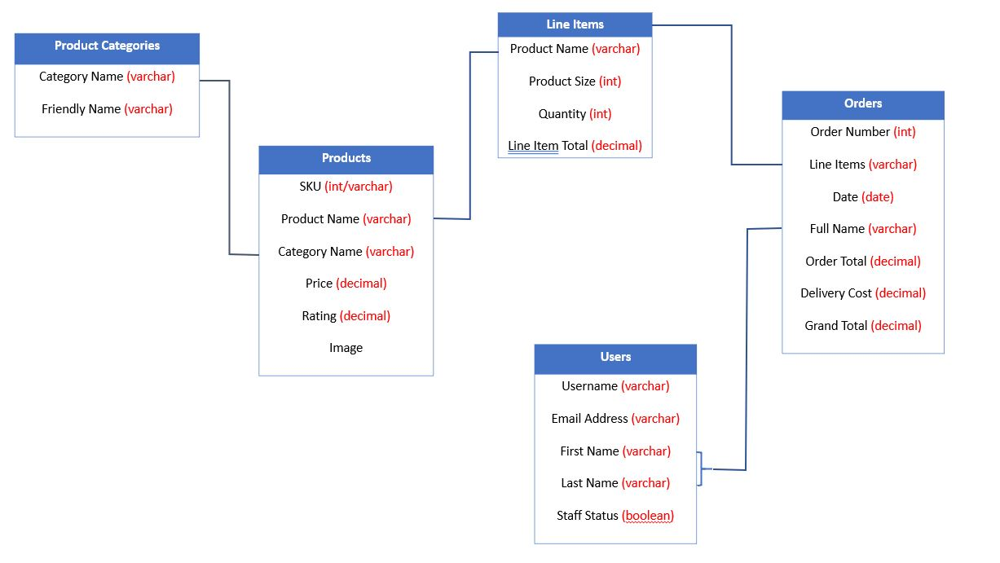

<td></td>

## Camp Rover Ecommerce App 

#### View Github Pages site [here](https://katyacano.github.io/milestone-project-4/)
#### View Heroku deployed app [here](https://kc-ms4-camp-rover.herokuapp.com/)  
 
 

# User Stories (UX)

## Shopper Goals
| User Story No.  |  As A/An  |  A User Should Be Able To  |  So That They Can  |
| :-------------: | --------- | -------------------------- | ------------------ |
|        1        | Shopper   | Sort a specific category of product. | Find the type of item they need to purchase, whether it be for day care, training services or accessories.|
|        2        | Shopper   | Easily see search results and number of results. | Quickly determine if the store offers the product or service they need. |
|        3        | Shopper   | View list of products.    | Select some to purchase.|
|        4        | Shopper   | View individual product details. | Identify the price, description, product rating, product image (if applicable), and sizes (if applicable). | 
|        5        | Shopper   | Easily view the total amount of intended purhase.  | Know how much they will be spending. |
|        6        | Shopper   | Be able to easily select the product or service they need, including (if applicable) the size and quantity. | Make sure they purchase the right products and services. |
|        7        | Shopper   | View items ready for purchase in cart. | Understand the total cost of their purchase and ensure they have the right items in cart.|
|        8       | Shopper   | Adjust the quantity of items within the cart.  | Easily make changes to their intended purchase if needed. |
|        9       | Shopper   | Easily enter payment information. | Complete the purchase.|
|        10       | Shopper   | Have confidence in the security of my personal information. | Feel that my purchase is safe and that I can return to this site for future purchases.|
|        11       | Shopper   | View an order confirmation at the end of the transaction and receive a confirmation email. | Know that the purchase is complete and be able to keep a record of it. |

 

## Visitor Goals
| User Story No.  |  As A/An  |  A User Should Be Able To  |  So That They Can  |
| :-------------: | --------- | -------------------------- | ------------------ |
|        1        | Visitor   |   Register for an account and have a personal profile.   | Have a personal site account where their personal information can be stored. |
|        2        | Visitor   | Easily log in or out. | Quickly access personal details of account, previous orders, etc. |
|        3        | Visitor   |   Recover a lost or forgotten password.  | Never lose access to shopping account and details. |
|        4        | Visitor   |   Receive an email confirmation of account setup.| Verify that account was set up correctly. |

  

 ## Site Owner Goals
| User Story No.  |  As A/An  |  A User Should Be Able To  |  So That They Can  |
| :-------------: | --------- | -------------------------- | ------------------ |
|        1        | Owner   | Add products.    | Continously update the store with more products and services customers need and want.|
|        2        | Owner   | Edit products. | Change product and service details, prices, and descriptions as necessary. | 
|        3        | Owner   | Delete a product.  | Remove product and service offerings as needed. |

  

# Design

  ### Color Scheme
  - The main colors used will be black, gray, white, and a yellow variant (specifically, #F7DC6F)
  ### Typography
  - The font for the logo is Boogaloo from Google Fonts 
  - The font family used for this site will be Lato throughout the site, with San Serif as the fallback if such font family is not being imported 
  ### Imagery 
  - Imagery is very important on this app. It will be used to appeal to dog owners specifically and feature a variety of dogs. The images will be professional and acquired from Unsplash. Product images are very important and will be featured with a white background in order to show as much detail. Because this is a fictitious company created for this project, professional products images have been acquired from various Amazon.com product pages 

 
 

# Wireframes

## Home Page
<td>
 
</td>

 
 

## About Page
<td>
 
</td>

 
 

## Product Pages
Day Care, Training, Accessories and Special Offers pages will all have the following layouts on desktop and mobile devices.
<td>
 
</td>

 
 
 

# Features

- Responsive on all device sizes
- Interactive elements: 
    - Search bar
    - Register form
    - Sign In/Out actions
    - My Profile update form
    - Log in/ log out actions
    - Go to secure checkout 
    - Adjust order option at checkout
    - Secure checkout page
    - Product management (Add a product) page for admin
    - Edit product page for admin
    - Edit/Delete options for each product (visible only to admin/superuser)

 
 

# Technologies Used

## Languages Used
- [HTML5](https://en.wikipedia.org/wiki/HTML5)
- [CSS3](https://en.wikipedia.org/wiki/Cascading_Style_Sheets)
- [Javascript]( https://www.javascript.com/) 
- [Python](https://www.python.org/)

 

## Frameworks, Libraries & Programs Used

[Google Fonts:](https://fonts.google.com/)
   - Google fonts were used to import the Roboto font family into the style.css file which is used on all pages throughout the project

[GoogleImages:](https://www.google.com/)
   - Google was used to find images for the Day Care, Training and Special Offers categories where and I was unable to find suitable images for other parts of the site 

[GMail:](https://mail.google.com/)
   - Gmail was used to send confirmation emails (profile set-up, purchases, etc.)

[Font Awesome:](https://fontawesome.com/start)
   - Font Awesome was used on all pages throughout the website to add icons for aesthetic and UX purposes

[Bulma:](https://bulma.io/)
   - Bulma was used to ensure that Font Awesome icons would stay consistently sized and centered

[Bootstrap:](https://getbootstrap.com/)
   - Bootstrap was used to assist with the responsiveness and styling of the website

[jQuery:](https://jquery.com/)
   - jQuery came with Bootstrap to make the navbar responsive but was also used for the smooth scroll function in JavaScript

[Git:](https://git-scm.com/)
   - Git was used for version control by utilizing the Gitpod terminal to commit to Git and Push to GitHub

[GitHub:](https://github.com/)
   - GitHub is used to store the projects code after being pushed from Git

[Balsamiq:](https://balsamiq.com/)
   - Balsamiq was used to create the wireframes during the design process

[PicResize:](https://picresize.com/)
   - PicResize was used to resize the Home page image

[Postgres:](https://www.postgresql.org/)
   - Postgres was used for the app database and to store collected data

[Heroku:](https://www.heroku.com/)
   - Heroku was used to deploy the application

[Amazon Web Services:](https://aws.amazon.com//)
   - Amazon Web Services was used to store static and media files

[Stripe:](https://stripe.com/)
   - Stripe was used as the payment gatewway to process payments from customers on the site

[Django:](https://www.djangoproject.com/)
   - Django was used as a framework to facilitate rapid site development

[TempMail:](https://temp-mail.org/)
   - TempMail was used to create a temporary email to enable the creation of test profiles

[MiniWebTool:](https://miniwebtool.com/django-secret-key-generator/)
   - MiniWebTool's Django Secret Key Generator was used to generate secret keys

[W3C Validator:](https://validator.w3.org/)
   - This validator was used to check HTML and CSS

[PEP 8 Online Validator:](http://pep8online.com/)
   - This validator was used to check Python code

[JSHint:](https://jshint.com/)
   - This validator was used to check Javascript code 

 

# Database and Database Schema
Postgres is the database used for storing product categories, product details, user’s profile details and previous order information. 
The schema is as follows:
<td></td>

 
 

# Defensive Design (Security Features)
Defensive design and security features have been achieved by:
- Utilizing inbuilt Django validation and authentication features
- Assigning a specific Staff status to each user and only allowing those users labeled as Staff access to product management site features
- Users must sign in to view order history and personal profile details
- Users cannot view other users' previous order history and personal information
- If a user tries to enter a url for a protected area of the site, the Django @login required decorator and superuser class will stop the action and flash a warning message stating that only store owners are allowed access to that area
- If a user tries to checkout with an empty shopping bag, a warning messages lets them know that there is nothing in their shopping bag
- Email fields with correct email structure are required fields for registering onto the site as a new user
- When registering as a new user, a visitor is required to enter email and password twice to ensure they enter information correctly

 
 

# Testing

## Manual Testing

### **Test-** Clicking Camp Rover logo should return user to home page.
- Result: Tested logo on all pages and action works as intended. No errors.

### **Test-** Clicking on navbar links should direct user to corresponding pages.
- Result: Tested all links (in desktop, tablet and mobile modes) before and after logging in. Links work as intended. No errors.

### **Test-** Entering required info on Register page and clicking on Register button should create a new user in database.
- Result: Entered data for user 'testytest'. Action completed as intended. No errors.

### **Test-** Entering valid user info on Log In page and clicking on Log In button should allow user access to app and direct user to Home page.
- Result: Tested by entering info for all three current users. Action worked as intended. No errors. 

### **Test-** Entering invalid user info on  Log In page and clicking on Log In button should not grant access to app and flash an error message.
- Result: Tested with three different user entries. Action works as intended. No errors. 

### **Test-** Entering required information on Add Product page should result in a new product being added to database.
- Result: Tested all entry fields. Action works as intended. No errors. 

### **Test-** Missing any information on Add Product page should result in error messages for each line that is missing or has insufficient characters.
- Result: Tested by entering various combinations of information/misinformation. Action works as intended. No errors.

### **Test-** Edit/Delete buttons for each product should only be visible to super user designated as "Staff" in database. 
- Result: Tested with different users. Action works as intended. Users are not able to edit or delete products unless they are superusers. No errors.

### **Test-** Search function should look for keyword matches in category name, product, and product detail pages. 
- Result: Tested with various keywords from all fields. Action works as intended. When keyword was found in any of these pages Search function returned a match. When keyword was found in other areas (ie. Username), no result was found and No Result message falshed. 

 
 

## Testing Shopper Goals (UX)  

| User Story No.  |  A User Should Be Able To  |  Outcome  |
| :-------------: |-------------------------- | ------------------ |
|        1        | Sort a specific category of product | There are Day Care, Training, Accessories and Special Offers links in the main navigation bar for shopper to select a category. Some of these links contain interior links that further narrow a category. Tested links and all work as designed on desktop and mobile devices. 
|        2        | Easily see search results and number of results | A Search link is located next to the Account link for easy access on any page within the site. Tested search function and it works as designed. |
|        3        | View list of products    | There are Day Care, Training, Accessories and Special Offers links in the main navigation bar for shopper to view products. Tested all link and they work as designed.|
|        4        | View individual product details | All products contain links to a product detail page that provides a description of the product, price, sizing and options to select quantity and add to shopping bag. Tested all products and all have a properly functioning product detail page. | 
|        5        | Easily view the total amount of intended purhase  | There is a shopping bag icon link at the top right-hand side of the screen visible on all pages of the site. The total amount of the intended items for purchase currently in the shopping bag is listed below the item. Tested with various combination of items. All work as intended. |
|        6        | Be able to easily select the product or service they need, including (if applicable) the size and quantity| Shoppers can select the items they wish to purchase in the Products and Services and pages which will then take them to the product detail pages where they can select the quantity, size (if applicable) and add to shopping bag. Tested on all products and they work as intended.|
|        7        | View items ready for purchase in cart | Shoppers can click on the Shopping Bag icon in the top left corner of the page (visible on all pages of the site) to be directed to their shopping bag page. Tested with various orders, containing products and services from different categories, and functionality of Shopping Bag page works as intended.|
|        8       | Adjust the quantity of items within the cart  | Shoppers can adjust the quantities, up or down, of the items in the Shopping Bag without leaving the page. They can also delete items they no longer wish to buy. Functionalities work as intended. |
|        9       | Easily enter payment information | Shoppers can easily go to a secure checkout page from the Shopping Bag page by clicking the "Secure Checkout" button at the bottom of this page. Tested with various orders from different users and all works as intended.|
|        10      | Have confidence in the security of my personal information | A shopper's payment for purchase is securely processed via the Stripe payment processor.|
|        11      | View an order confirmation at the end of the transaction and receive a confirmation email | Once payment is complete the shopper will see a confirmation message on the same screen and this message informs them that they will also receive a confirmation email. Tested several orders using a test credit card from Stripe and all processed succesfully and received a confirmation email to the test shopper's email.  |

 

## Testing Visitor Goals (UX)
| User Story No.  |  A User Should Be Able To  |  Outcome  |
| :-------------: | -------------------------- | ------------------ |
|        1        |   Register for an account and have a personal profile    | There is a My Account icon at the top right-hand corner of the header that is visible from all pages on the site. There a new visitor is able to register for a new account by select "Register". Visitors who begin shopping before they register for an account are also able to register upon completion of their order at checkout. Tested with different users and orders and this function works as intended. |
|        2        |   Easily log in or out | Visitors can easily log in or our of the site via the My Account icon at the top right-hand corner of the navigation, which is visible from all pages of the site. Tested various times and functionality works as intended. |
|        3        |   Recover a lost or forgotten password  | Visitors can reset their password by clicking on "Forgot Password?" link located at the bottom of the Sign In page. |
|        4        |   Receive an email confirmation of account setup    | New visitors that sign up for an account will receive a confirmation email sent by the store. Tested this functionality with various users, with real and temporary emails and this process works as intended. |

  

 ## Testing Site Owner Goals
| User Story No.  |  A User Should Be Able To  |  Outcome  |
| :-------------: | -------------------------- | ------------------ |
|        1        | Add products    | An admin or superuser can add new products from the front end and admin side of the site. From the front end, they can select "Product Management" from the drop down menu found under the My Account icon. This will only be visible if the user is a superuser and if they are logged in.|
|        2        | Edit products | An admin or superuser can add new products from the front end and admin side of the site. From the front end,they can select the "Edit" link that is located below each product or service card and also within the Product Details page. This option is only visible to is the user is a superuser and if they are logged in. | 
|        3        | Delete a product  | RAn admin or superuser can add new products from the front end and admin side of the site. From the front end,they can select the "Delete" link that is located below each product or service card and also within the Product Details page. This option is only visible to is the user is a superuser and if they are logged in. |

 
 

## Testing Responsiveness
### Responsiveness of the app was tested using Google Dev tools. The following issues were found and fixed accordingly:
| Issue Found  |  Fix Applied  |  Outcome  |
| ------------- | -------------------------- | ------------------ |
| When viewing in mobile phone view, Search, Account, and Shopping Bag links were pushed off center and distorted. | Changed and deleted class for div assigned to links. Applied boostrap classes to specific div. | Links and corresponding text on the side is properly aligned. |
| Heroku updated database and in the process changed the postgres database url causing data from local version sql database to not be transferred over to Heroku app on load data command. | Worked with tutor support to identify the issue. Deleted original json file containing database and dumped data once more into new db.json file. Copied new postgres database url to camp_rover/settings.py file and in Heroku Config Vars settings. Once again entered command to load data to Heroku app. | Data transfer was successful. |
| Some product images were broken during new data transfer from development version. | Reviewed image files in deployed app's admin panel and discovered that in data transfer some image file names were transferred over with random characters at the end of the file name, thereby breaking the link. Via the admin panel, manually changed each file name for images that were broken. | No broken images observed. |
| Deployed app loaded very slowly. | Reviewed image file sizes and discovered that Home page and About Us page images as well as some product images were too large. Used PicResize to resize those images, deleted original files from AWS S3 storage and replaced with smaller files. | App loads much faster. |

  
 
 

# Code Validation

### Code was validated using the following:
#### **Python3**
- Validator: (http://pep8online.com/)
- **Outcome:** First test resulted in several errors pertaining to trailing whitespaces, line-too-long and various linting errors. Corrected all trailing whitespace and line-too-line errors possible. Ignored the linting errors on advice of tutor and Slack community.

#### **HTML & CSS**
- Validator: (https://jigsaw.w3.org/css-validator/)
- **Outcome:** First test failed with various errors due to missing elements (paragraph and div) and Jinja syntax. Corrected errors. Second test passed with zero errors.

#### **Javascript**
- Validator: (https://jshint.com/)
- **Outcome:** Tests of various javascript code passed with no errors. 

 
 

# Deployment to Github Pages
**To deploy to GitHub Pages use the following steps:**

1. Log in to GitHub and locate your GitHub Repository. For this particular project the name is **milestone-project-4**.
2. At the top of the Repository, find the "Settings" button and select it. 
3. Scroll down the Settings page and find "GitHub Pages" section. Click on "Pages settings now has its own dedicated tab! Check it out here!" 
4. Under "Source", click the dropdown called "None" and select "Master Branch" and click "Save" button that pops up.
5. The page should automatically refresh but if it doesn't, refresh the page.
6. Click on "Your site is ready to be published at https://katyacano.github.io/milestone-project-4/" that appears after refresh.

**To clone this repository use the following steps:**

1. When logged into GitHub, navigate to the repository you want to clone. For this project, click here.
2. Click on the 'Clone or download' button which should be displayed above and to the right of the repository files.
3. You are presented with a HTTPs address. Copy this address by pressing the button to the right of the address.
4. Open your terminal.
5. Change the current working directory to the location where you want the cloned directory to be made.
6. Type 'git clone' and then paste the URL you copied.
7. Press Enter and your local clone will be created.

 
 

# Deployment to Heroku
To deploy to Heroku use the following steps:
1. On Heroku create an account and log in.
2. Click new and create new app.
3. Choose a unique name for your app, select region and click on Create App
4. Under the Settings click Reveal Config Vars and set IP to 0.0.0.0 and the PORT to 5000
5. Go to the CLI and type $ sudo snap install --classic heroku
6. Type $ heroku login command into the terminal
7. Create requirements.txt ($ sudo pip3 freeze --local > requirements.txt)
8. Create a Procfile ($ echo web: python app.py > Procfile)
9. Go back to Heroku, under Deploy find Existing Git repository and find corresponding Git repository by name. 
10. In the app dashboard, under Settings click on Reveal Config Vars
11. Set "DATABASE_URL" and "SECRET_KEY".
12. Once the build is complete, go to Domains section of Settings page and you will find a link to app.
13. Other Config Vars you will set include: AWS_ACCESS_KEY_ID, AWS_SECRET_ACCESS_KEY, EMAIL_HOST_PASS, EMAIL_HOST_USER, STRIPE_PUBLIC_KEY, STRIPE_SECRET_KEY, STRIPE_WH_SECRET, and USE_AWS.

 
 

# Future Development

## Future development goals for this site include:
 - More products in the Accessories categories
 - More service offerings including overnight boarding, grooming and additional training options
 - Log in via Facebook
 - The ability to add user's photo to Profile page
 - The ability to add a user's pet info within their profile page (pet name, breed, photo, etc.)
 - Ability for a user to rate a product or service offering
 - Ability for a user to store their commonly purchased products or services in a Favorites folder for quick access

 
 

# Credits

## Code
 - [Bootsrap:](https://getbootstrap.com/) Boostrap was used throughout the project to rapidly achieve responsiveness 
 - [Bulma:](https://fontawesome.com/start) Bulma was used to ensure that Font Awesome icons were consistently sized and centered 
 - [JQuery:](https://jquery.com/) jQuery was used to facilitate functionality of Bootstrap and other functions
 - [StackOverflow:](https://stackoverflow.com//) Stack Overflow was instrumental in solving code issues like dynamically changing page titles, breaking line-too-long Flake8 errors, and centering icons in mobile view
 - [Code Institute:](https://codeinstitute.net/) Code Institute learning modules set the foundation for generating the code on this site
 
 

## Content
  - All content, except as otherwise already noted here, was written by the developer

 

## Media
Image sources are as follows:
- Home page image was acquired from [Unsplash.com]( https://unsplash.com/) 
- About Us image was acquired from [Unsplash.com]( https://unsplash.com/) 
- Photos of Daycare and Training services were acquired from [GoogleImages](https://www.google.com/search?q=images&source=lnms&tbm=isch&sa=X&ved=2ahUKEwj0vs7rjYTxAhXxoFsKHXxVDmwQ_AUoAXoECAEQAw&biw=1920&bih=969)   
- Product images and descriptions were acquired from [Amazon.com]( https://amazon.com/) since this is a school project and will not be made public

 

## Acknowledgements
- My Mentor Brian for continuous helpful feedback
- Tutor Support at Code Institute for their support
- CI Slack community for their ongoing assistance

